# ShaderProject — DirectX 11 リアルタイムレンダラー

> 作品技術資料 / Technical Documentation

| 項目     | 内容                                  |
| ------ | ----------------------------------- |
| 作品名    | ShaderProject                       |
| 種別     | 個人制作（ポートフォリオ作品）                     |
| 制作期間   | 約3ヶ月                                |
| 開発人数   | 1人                                  |
| 使用技術   | DirectX 11 / C++ / HLSL             |
| 題材モデル  | SD ユニティちゃん（SD_unitychan_generic.fbx） |

---

## 概要

グラフィックスプログラマーを志望するにあたり、描画パイプラインを「使う」側から「理解して自分で組む」側に回ることを目標に、DirectX 11 で一からレンダラーを設計・実装した個人制作です。
ライブラリの API を呼ぶだけでは見えない、シャドウマップ・GPU スキニング・PBR/IBL・レイマーチングといった各技術が「なぜその手順で成り立つのか」を、実際に手を動かして確かめることを主眼に置きました。

併せて、機能数を増やすこと以上に「増えても壊れにくい構造」をどう設計するかを継続的なテーマとし、統括クラス `APP` を薄く保って機能をマネージャー単位に分離しています。
実装した各機能は ImGui から実行時に調整でき、GPU プロファイラで各パスの負荷を測り、バッファビューアで中間出力を覗きながら詰められる構成にしています。

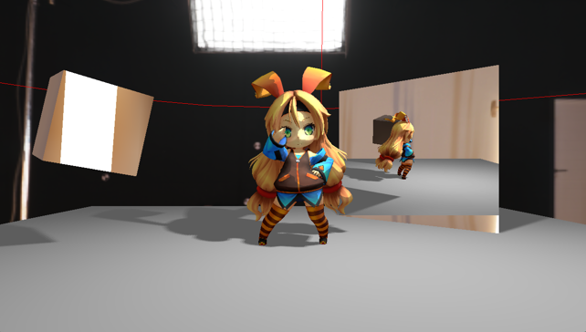

---

## 開発環境

| 項目      | バージョン                  |
| ------- | ---------------------- |
| OS      | Windows 11 64bit       |
| グラフィックスAPI | DirectX 11          |
| 言語      | C++17 / HLSL           |
| IDE     | Visual Studio 2022     |
| モデルロード  | Assimp 6.0.4（vcpkg 経由） |
| UI      | Dear ImGui             |
| 画像ロード   | stb_image              |

---

## 実装機能

| カテゴリ        | 機能                                                                  |
| ----------- | ------------------------------------------------------------------- |
| 基盤          | DirectX 11 初期化、定数バッファ、マルチポリゴン描画                                      |
| モデル         | Assimp によるモデルロード（ノード階層の再帰処理）、テクスチャ適用                                 |
| カメラ         | オービタルカメラ（注視点中心の回転）                                                  |
| ライティング      | Phong（4種：点光源 / 平行光源 / スポット / エリア）、マルチライト対応（最大8）                      |
| 影           | キューブ配列シャドウマップ（全ライト種を統一管理）、PCF ソフトシャドウ                               |
| マテリアル表現     | 法線マッピング、トゥーン（セルシェーディング）、アウトライン、リムライト、ディゾルブ、鏡面反射（レンダーテクスチャ）           |
| PBR         | Cook-Torrance BRDF（GGX / Schlick / Smith）、IBL（自前ベイク）、スカイボックス        |
| アニメーション     | GPU スキニング（スケルタルアニメーション、87 ボーン）                                       |
| 大気表現        | レイマーチングによるプロシージャル雲（fbm 密度 / ライトマーチ / 深度合成、ImGui で実行時調整）              |
| ポストプロセス     | ACES トーンマッピング、ガンマ補正                                                  |
| 開発・デバッグ支援   | GPU プロファイラ（パス別 GPU 時間計測）、中間バッファビューア（影 / IBL / 鏡の可視化）                  |

---

## アーキテクチャ

本プロジェクトで最も重視したのは **責務の分離（Separation of Concerns）** です。
各クラスに「1つの仕事だけ」を持たせ、誰が何を担当するかを明確にしています。

### 階層構造

```
main.cpp                … エントリーポイント。メッセージループを回し Update / Draw を呼ぶ
   │
  APP                   … 統括コーディネーター。DirectX 初期化と各マネージャーの所有・指示
   │
  各マネージャー          … 各分野の専門家
   ├ GAME_OBJECT_MANAGER … シーン内の全オブジェクトを所有・管理
   │   └ LIGHT_MANAGER   … 複数ライトの管理（ライトはシーンに属するため本マネージャー配下）
   ├ SHADER_MANAGER      … 全シェーダーの生成・保持
   ├ SHADOW_MANAGER      … 影マップの生成
   ├ IMGUI_MANAGER       … デバッグ UI の管理
   └ IBL_BAKER           … 環境マップのベイク
   │
  GAME_OBJECT（抽象基底） … 「シーンに置けるもの」の共通インターフェース
   ├ MODEL   … 3Dモデル
   ├ FIELD   … 床
   ├ MIRROR  … 鏡
   ├ CAMERA  … カメラ
   └ LIGHT 他 … ライトなど
```

### 1フレームの描画フロー

描画パスは **依存関係の順** に並んでいます。後のパスが入力として使うデータを、先のパスが生成します。

```
影パス      → 影マップ（深度テクスチャ）を生成
  ↓
鏡パス      → 反射テクスチャを生成（影マップを使い、鏡の中の景色にも影を反映）
  ↓
メインパス   → 影マップと反射テクスチャを消費して最終描画（スカイボックス含む）
  ↓
雲パス      → 全画面レイマーチングで雲を描き、深度テストで背景に合成
  ↓
（デバッグ時）ビューア → 選択した中間テクスチャを全画面に上書き表示
  ↓
ImGui      → UI と GPU プロファイラを最前面にオーバーレイ
```

各パスの GPU 時間は GPU プロファイラで計測しており、パスの重さを数値で把握できます（後述）。

### 設計上の工夫

- **APP を薄く保つ**：APP は初期化と各マネージャーへの指示のみを担当し、具体的な処理は持たない。新機能の追加時も APP をほとんど変更せずに済む。
- **マネージャーパターン**：機能ごとに管理クラスを分離し、各クラスが1分野だけを受け持つ。
- **抽象基底クラス + ポリモーフィズム**：`GAME_OBJECT` が共通インターフェース（`Draw` / `Update`）を定義し、マネージャーは型を意識せず一括処理できる。新しいオブジェクトは `GAME_OBJECT` を継承するだけで既存コードを変更せずに追加可能。
- **`std::unique_ptr` による所有管理**：マネージャーがオブジェクトを所有し、解放を自動化（手動 delete 不要）。
- **`SHADOW_PASS_CONTEXT`（データ構造によるパス間の疎結合）**：影パスに必要なデータを構造体でまとめて渡すことで、`SHADOW_MANAGER` を他クラスから切り離す。
- **`DrawInternal` / `DrawWithViewProj` パターン**：通常描画と反射パス描画で実装を共有し、ViewProj だけ差し替える。

### 主要な設計判断（採用と理由）

各機能を「動かす」だけでなく、選択に明確な根拠を持たせることを重視しました。代表的な判断を挙げます。

- **定数バッファを更新頻度で分割**：wvp（オブジェクト毎）・ライト配列（フレーム毎）・ボーン行列（スキン時のみ）を別レジスタに分離（`b0` / `b1` / `b8`）。1つの巨大バッファにまとめる方式に比べ、変化した値だけを再送でき、毎オブジェクトでのライト情報の無駄な再アップロードを防ぐ。スロットの取り違えで全ライト配列を上書きしてしまうバグを経て、更新頻度で整理する設計に至った。
- **スキニングはシェーダーを分割**：スキンメッシュは頂点にボーン番号・重みを持ち、非スキンとは入力レイアウトが異なる。1本のシェーダー内の `if` 分岐では異なる頂点フォーマットを扱えないため、ピクセルシェーダー（ライティング）を共有しつつ頂点シェーダーをバリアントとして分離した（シェーダー順列）。
- **GPU スキニング**：ボーン行列パレットのみを定数バッファに送り、頂点変形を頂点シェーダーで並列実行。CPU で全頂点を変形して毎フレーム頂点バッファを再アップロードする方式に比べ、計算・帯域の両面で有利。
- **シェーダーは実行時コンパイル**：HLSL を起動時に `D3DCompileFromFile` でコンパイル。事前コンパイル（.cso）より起動は遅いが、シェーダーを書き換えて即確認でき C++ の再ビルドが不要。試行錯誤の反復速度を優先した。
- **トーンマップを ACES に統一**：全ライティングパスおよびスカイボックスで ACES（Narkowicz 近似）を採用。Reinhard も実装・比較した上で、ハイライトの伸びとコントラスト、および背景の空と IBL 反射の色味整合を理由に統一した。
- **影・鏡はレンダーテクスチャ**：光源視点・鏡像カメラ視点でシーンをテクスチャに描き、メインパスで参照。シャドウボリュームや SSR に比べ任意形状を正確に扱える（代償として再描画コストは増える）。

---

## 注目モジュール

### 影 — キューブ配列シャドウマップ + PCF

#### 概要

点光源・スポット・エリア・平行光源の全ライト種を、1つの `TextureCubeArray` に統一してベイクするシャドウシステム。
PCF（Percentage Closer Filtering）により、影の輪郭を柔らかくしています。

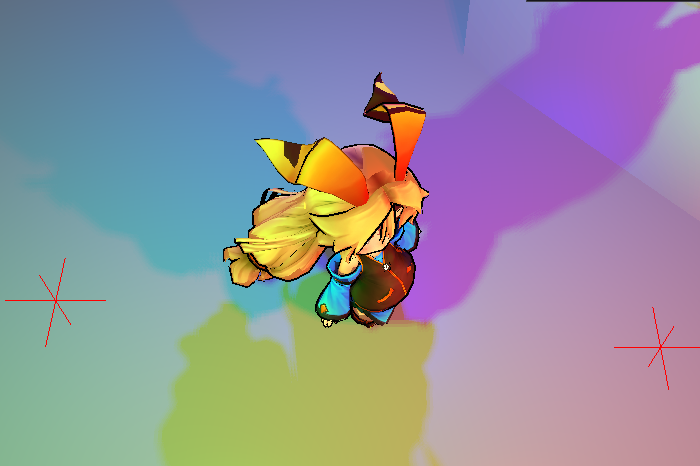

#### 実装のポイント

- 全ライト分の影を1つのキューブ配列テクスチャにまとめ、ライトインデックスでアクセスする構成。
- ライト種ごとの影生成（点光源は6面キューブ、平行光源は正射影など）を統一的に扱う。
- PCF はキューブシャドウに対して固定軸（X/Z）のワールド空間オフセットでサンプリングし、真下付近での回転由来のアーティファクトを回避。

**苦労した点**

**① シャドウアクネ**

- **問題**：距離を 0〜1 に正規化・丸めて保存する過程で誤差が出て、平らな面が「自分の距離 > 保存された自分の距離」と僅差で誤判定し、縞状のチラつきが発生した。
- **解決**：距離比較にバイアスを入れ、`lCurrentDist - lBias > lClosestDist` の形で「バイアス分を超えて遠いときだけ影」と判定。バイアスは `max(0.05, 距離 × 0.02)`（距離比例＋最低保証）にした。
- **なぜこの方法か**：定数バイアス1つだと「小さすぎ＝アクネ／大きすぎ＝影が浮くピーターパン現象」を1つの値で抱える。遠い面ほど距離の量子化誤差が大きいので距離比例で適応させ、近距離でも下限を割らないよう最低保証 0.05 を足した。法線オフセットやハードウェアのスロープスケール深度バイアスも候補だが、実距離を保存するキューブシャドウと素直に噛み合う「距離比例＋下限」を選んだ。

**② キューブシャドウの PCF オフセット方向**

- **問題**：PCF のサンプルをずらす2軸を接線・従法線の外積で求めていたが、ライト真下付近で外積が不安定になり軸が不連続に回転、縁にアーティファクトが出た。
- **解決**：引く方向に依存しない固定ワールド X/Z 軸（`(offsetScale,0,0)` と `(0,0,offsetScale)`、offsetScale は距離比例）でずらす方式に変更した。
- **なぜこの方法か**：外積は2ベクトルが平行に近いとゼロに近づいて破綻し、光が真下（≈(0,-1,0)）を向く特異点を持つ。固定軸はその特異点が無く常に安定。「引く方向に厳密に垂直でない」欠点はあるが、ずらし量がごく小さい（0.008 × 距離）ため実害がなく、安定性が勝る。

#### 参考資料

- LearnOpenGL — Shadow Mapping / Point Shadows の章（基本的なシャドウマップと立方体シャドウの考え方） <https://learnopengl.com/Advanced-Lighting/Shadows/Shadow-Mapping>
- Microsoft Docs — Common Techniques to Improve Shadow Depth Maps（PCF・バイアス・シャドウアクネ対策）
- opengl-tutorial — チュートリアル16：シャドウマッピング（2パス構成・アクネ・ピーターパニング・PCF・キューブによる点光源シャドウ／日本語） <https://www.opengl-tutorial.org/jp/intermediate-tutorials/tutorial-16-shadow-mapping/>
- ayaha401 — 【Unity】自作したシャドウマップにソフトシャドウをつけてみる（PCF の平均処理を図解／日本語） <https://qiita.com/ayaha401/items/dc8a291533d6c16b7219>

---

### トゥーン — セルシェーディング + リムライト + ディゾルブ

#### 概要

ライティング結果を段階化（3トーン）してアニメ調の陰影を作るセルシェーダー。
輪郭を光らせるリムライトと、ノイズテクスチャでメッシュを溶かすように消すディゾルブ表現を備えます。

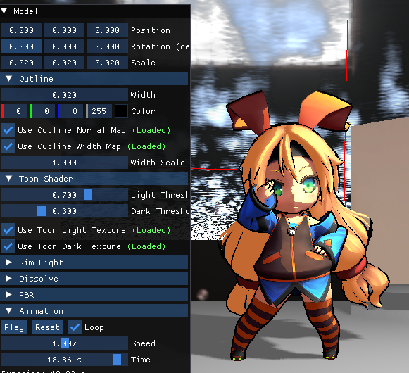


#### 実装のポイント

- 段階ごとに専用テクスチャ（ライト／ダーク）を割り当て、トーンを制御。
- リムライトは視線とのなす角で輪郭を強調。
- ディゾルブはノイズテクスチャと閾値の比較で `discard` し、境界部分に発光色を乗せる。特定のシェーダーに固定せず、共通関数 `ApplyDissolve` として各ピクセルシェーダーに差し込む修飾子として実装しており、トゥーン以外やアウトラインにも同じノイズ・閾値で適用される。

**苦労した点**

**① 複数ライト下でのバンド崩壊**

- **問題**：各ライトの寄与を単純加算すると合計が膨らみ、全ピクセルが明部バンドへ押し上げられて3トーンの段階分けが崩れた。
- **解決**：バンドと色で役割を分離。バンドを決めるトーン係数は全ライト寄与の `max`（最も強い光を採用）、色味は各ライト色を寄与で加重平均して別に合成した。
- **なぜこの方法か**：加算はトーンの量子化と相性が悪く、しきい値を全て突破してしまう。`max` は「一番強い光がそのピクセルのバンドを決める」という直感に合い、ライトが増えても破綻せず、重なりによる小ハイライトの乱れも防げる。色まで `max` にすると複数光源の色が混ざらないので、バンド＝max・色＝加重平均と分けた（標準的なトゥーンの定石とも一致）。

**② 黒つぶれ**

- **問題**：暗部をそのまま計算すると影側が完全な黒に潰れ、アニメ調の「影にも色がある」質感が出なかった。
- **解決**：環境光として下限を設け、`max(litColor, baseColor × 0.15)` で暗部が真っ黒にならないようにした。
- **なぜこの方法か**：全体を底上げ（litColor + ambient）すると明部まで明るくなりコントラストが鈍る。`max` 下限なら暗部だけを持ち上げ明部は不変。下限をベース色比例（× 0.15）にしたのは、一律グレーで素材の固有色が消えるのを避け、暗部にも色を残すため。

#### 参考資料

- Roystan — Toon Shader（しきい値による段階化、ランプテクスチャ、リムライト・スペキュラの実装手順） <https://roystan.net/articles/toon-shader/>
- Panthavma — Toon Shading Fundamentals（複数ライト時の max 合成、しきい値を取るタイミングなど、本実装と同じ論点を扱う） <https://panthavma.com/articles/shading/toonshading/>
- aiouku（Kei）— UnityでToonShaderを自作してみる（Step / Lerp による段階量子化の解説／日本語） <https://qiita.com/aiouku/items/1d8c8d279d4ff6181551>
- Tody — Unityシェーダー：ToonShader（トゥーンの原理と一次資料への入り口／日本語） <http://www.cloud.teu.ac.jp/public/MDF/toudouhk/blog/2014/12/25/UnityToonShader/>

---

### アウトライン — 背面法線押し出し

#### 概要

モデルの背面を法線方向に押し出して一回り大きく描画し、その差分を輪郭線として見せる手法。


法線マップ・幅マップによる輪郭の調整に対応しています。

#### 実装のポイント

- スムーズ法線を用いることで、エッジでの輪郭の途切れを防止。
- 幅マップにより、部位ごとに輪郭の太さを変化させられる。
- スキンメッシュ用にボーンパレットを適用したスキン版頂点シェーダーを用意し、押し出し方向（スムーズ法線）も同じく変形させることで、アニメーション中も輪郭が本体に追従する。
- ディゾルブと統合（共通関数 `ApplyDissolve` を経由）し、本体が溶ける領域でアウトラインも同期して消える。

**苦労した点**

**① 硬い辺での輪郭の途切れ**

- **問題**：陰影用の法線で押し出すと、角や UV の切れ目で隣接頂点がバラバラの方向へ飛び、輪郭が裂けて隙間ができた。
- **解決**：陰影用とは別に、隣接面の法線を平均した「スムーズ法線」を頂点属性として持たせ、押し出しにはそれだけを使うようにした。
- **なぜこの方法か**：陰影用法線を滑らかにすると角のハッキリした陰影が失われる。別チャンネルで持てば陰影は角を保ち、輪郭は連続を両立できる。Assimp の平滑法線生成に任せる代替は頂点マージで重く陰影にも影響するため、用途別に自前で持つ方が制御が効く（標準的なインバーテッドハル実装でもスムーズ法線を別属性に格納するのが定番）。

**② 法線・位置の同次座標の扱い**

- **問題**：押し出し方向をワールド変換する際、同次座標の4成分目を誤ると平行移動成分が向きに混入し、モデルが動くと押し出し方向がずれて輪郭が乱れた。
- **解決**：位置は `w=1`、押し出し方向（法線）は `w=0` で変換（`mul(float4(normal, 0), world)`）。
- **なぜこの方法か**：行列の平行移動は4行目にあり `w=1` のときだけ効く。点は移動すべきなので `w=1`、向きベクトルは移動してはならない（回転だけ）ので `w=0` で平行移動を無視させる。「点は w=1・方向は w=0」の原則を守ることで、モデルがどこに動いても押し出し方向が正しく保たれる。

**③ アニメーション時のアウトラインの追従**

- **問題**：当初アウトラインパスはスキン版シェーダーを持たず、バインドポーズの頂点バッファで描画していたため、本体がアニメで変形しても輪郭の殻はバインドポーズのまま固まり、輪郭が本体から剥がれた。
- **解決**：他のシェーダーと同様にスキン版頂点シェーダーを用意し、ボーンパレットで位置と押し出し方向（スムーズ法線）の**両方**を変形させてから押し出すようにした。
- **なぜこの方法か**：位置だけスキンして法線を放置すると、殻は動くのに押し出し方向がバインドポーズのままになり輪郭が暴れる。押し出し方向もスキンすることで姿勢と一致する。描画側はライティング用スキンメッシュと同じボーンパレット（`b8`）を共有するため、追加の状態管理は不要だった（②の「方向は w=0」原則をスキン行列にもそのまま適用している）。

#### 参考資料

- Delt06 — Inverted Hull Outline / toon-rp Wiki（背面押し出しによる輪郭、ライティング用法線とは別にスムーズ法線を持たせる手法、幅の制御） <https://github.com/Delt06/toon-rp/wiki/Inverted-Hull-Outline>
- 蒼水ゆい — アウトラインの実装（背面法）（背面法の頂点オフセット・前面カリングの解説／日本語） <https://atelier-aomi.hatenablog.com/entry/2025/09/28/180253>
- SolarisB2 — アウトラインシェーダを考える（角で輪郭が途切れる原因＝面法線、スムーズ法線が必要な理由を図解／日本語） <https://zenn.dev/solarisb2/articles/8b8dab0479f05c>

---

### PBR / IBL（実装済み・理解を深化中）

#### 概要

物理ベースレンダリング（Cook-Torrance BRDF）と、環境マップによる間接光（IBL）を実装しています。
IBL は HDR 環境マップから irradiance マップ・prefilter マップ・BRDF LUT を自前でベイクし、
split-sum 近似で間接光を計算します。

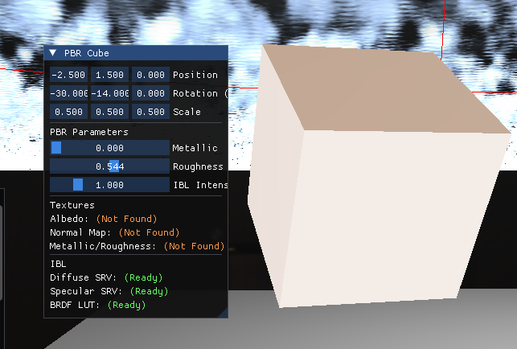

> ※ 本モジュールは実装済みですが、数式レベルの完全な理解は現在学習を進めている段階です。
> README では高レベルの説明に留め、誇張は避けています。

#### 参考資料

- Joey de Vries — LearnOpenGL（PBR Theory / Lighting / IBL の章） <https://learnopengl.com/PBR/Theory>
- Brian Karis（Epic Games）— "Real Shading in Unreal Engine 4"（SIGGRAPH 2013、IBL の split-sum 近似）
- Krzysztof Narkowicz — ACES Filmic Tone Mapping Curve（ACES トーンマッピング近似）
- techma. — PBRとIBLによる間接光を考慮したレンダリング（Cook-Torrance / Irradiance / Prefilter / BRDF LUT を DirectX 系で解説／日本語） <https://www.technicalife.net/pbr-ibl-rendering-2025/>

### 雲 — レイマーチング（プロシージャル）

#### 概要

水平な雲スラブに対して全画面レイマーチングを行い、手続き的に雲を生成・合成するパスです。
メイン描画の後に全画面パスとして走り、深度テストで背景（キャラ・床）に隠れるよう合成します。
雲量・濃さ・高度・太陽方向・風速・マーチ回数を ImGui から実行時に調整できます。

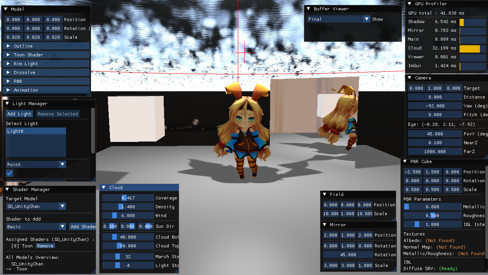
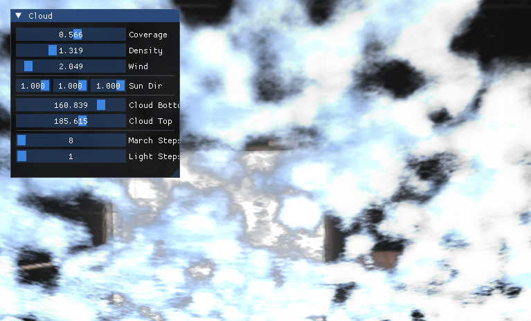

#### 実装のポイント

- カメラの逆 ViewProj からピクセルごとの視線ベクトルを復元し、水平スラブとの交点区間だけをマーチする（空全体を無駄に辿らない）。
- 密度は 3D 値ノイズを重ねた fbm。`coverage` でしきい値を動かし、スラブ上下端で放物線状にフェードして丸みを出す。風は時間で X 方向にスクロール。
- 各サンプルから太陽方向へ短くライトマーチし、ビール則 `exp(-Σdensity)` で雲内部の自己影を計算。Henyey-Greenstein 位相関数で逆光時のシルバーラインを表現。
- 全画面三角形を最遠深度で描くため、キャラや床に隠れる画素は深度テストで PS 実行前に破棄され、重いレイマーチのコストを払わない。

#### 設計判断（背景との合成方式）

- **採用**：深度テストによる合成。全画面三角形を最遠深度・深度書き込みなしで描き、既存の深度に隠させる。
- **代替案**：深度バッファを SRV 化し、PS でシーン深度を読んでレイ距離をクランプする（柔らかい交差）。
- **選定理由**：本作の雲は空の層で、キャラ・床と交差しない。代替案の利点（交差の柔らかさ）が効く場面が無い一方、深度バッファの作り替えコストだけ乗る。よって深度テスト方式が十分かつクリーンと判断した。

<!-- 参考資料 -->

#### 参考資料

- edo_m18 — [コードリーディング vol.2] レイマーチングによる雲表現を読み解く（fbm 密度・透過率／ビール則・ライトマーチの読解／日本語） <https://qiita.com/edo_m18/items/cbba0cc4e33a5aa3be55>

### 開発・デバッグ支援 — GPU プロファイラ / バッファビューア

グラフィックスプログラマーにとって、レンダラーは「作る」だけでなく「測る・覗く」ことが同じくらい重要です。
汎用ツール（RenderDoc など）に頼らず、本レンダラー専用の計測・可視化を自前で実装しました。

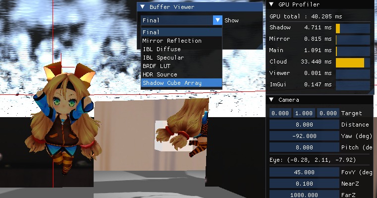

#### GPU プロファイラ

- D3D11 のタイムスタンプクエリで、各パス（影 / 鏡 / メイン / 雲 / ビューア / ImGui）の **GPU 実行時間（ms）** をパス別に計測し、ImGui に表示。
- 3フレーム遅延でクエリを読み戻すことで、計測自体が CPU をストールさせない（GPU 完了待ちを避ける）。
- 「どのパスが重いか」を数値で断定できるため、最適化対象を推測ではなく計測で決められる（例：雲パスが支配的と特定してからマーチ回数を詰めた）。

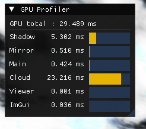

#### バッファビューア

- 各パスの中間テクスチャ（影のキューブ配列 / IBL の Diffuse・Specular / BRDF LUT / 鏡の反射 / HDR 環境マップ）を、ImGui のドロップダウンで選んで全画面表示。
- 2D テクスチャ・キューブマップ（equirectangular 展開）・キューブ配列（スライス選択）を、それぞれ専用のピクセルシェーダーで表示。
- 「間接光や影が正しく焼けているか」を目で確認でき、汎用フレームデバッガーの縮小版として機能する。

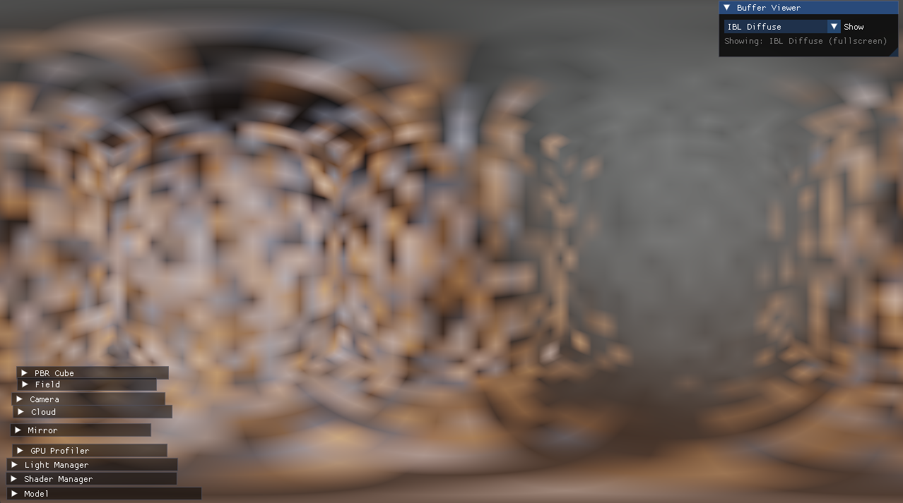
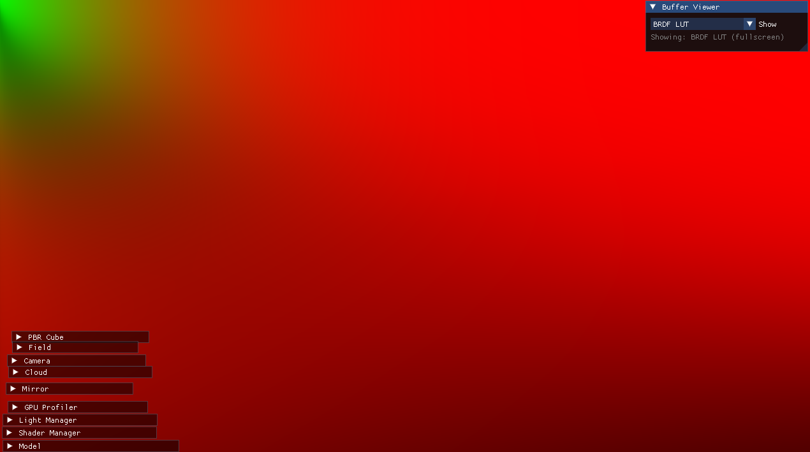
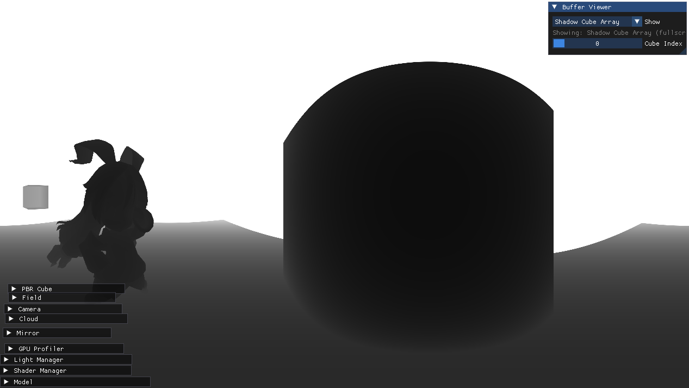

---

## ビルド手順

### 前提環境

- Windows 11 64bit
- Visual Studio 2022（ワークロード「C++ によるデスクトップ開発」）
- vcpkg（導入済みであること）

### 手順

1. リポジトリをクローン

   ```
   git clone <リポジトリURL>
   ```

   ※ モデル・テクスチャ・HDR 環境マップは `Assets/` に同梱済みのため、別途ダウンロードは不要です。

2. vcpkg で Assimp を導入し、Visual Studio と統合

   ```
   vcpkg install assimp:x64-windows
   vcpkg integrate install
   ```

   ※ Assimp 6.0.4 で動作確認。`vcpkg integrate install` により、Visual Studio がインクルード／ライブラリ／DLL を自動解決します。
   ※ Dear ImGui・stb_image はソースをリポジトリに同梱しているため、追加導入は不要です。

3. `ShaderProject.sln` を Visual Studio 2022 で開く

4. 構成を `x64 / Debug`（または `Release`）に設定

5. ビルドして実行（F5）。SD ユニティちゃんが表示され、ImGui パネルから各機能を切り替え・調整できます。

### 補足

- 実行時に Assimp の DLL が見つからないエラーが出る場合は、`vcpkg integrate install` が実行済みか確認してください（統合済みなら DLL は自動でコピーされます）。
- GPU は Direct3D 11（Feature Level 11_0）以上に対応したものが必要です。

---

## ライセンス・クレジット

- **SD ユニティちゃん**：© Unity Technologies Japan/UCL
  本作品はユニティちゃんライセンス条項（UCL）に基づいて配布されています。
  <https://unity-chan.com/contents/license_jp/>
- **HDR 環境マップ**：Poly Haven（CC0）
- **Assimp**：Open Asset Import Library（BSD ライセンス）
- **Dear ImGui**：© Omar Cornut（MIT ライセンス）
- **stb_image**：public domain / MIT

> ※ 各レンダリング技術は上記「参考資料」に挙げた標準的な文献・実装を参考に構築しています。